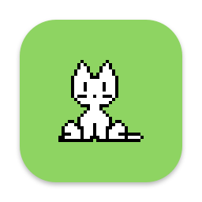
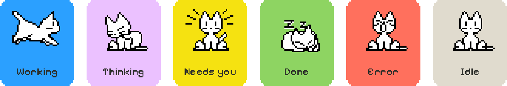
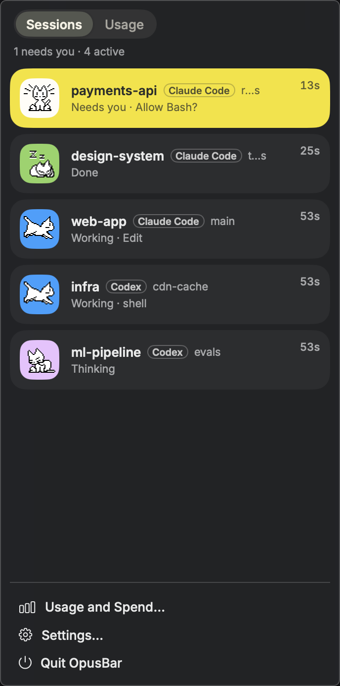
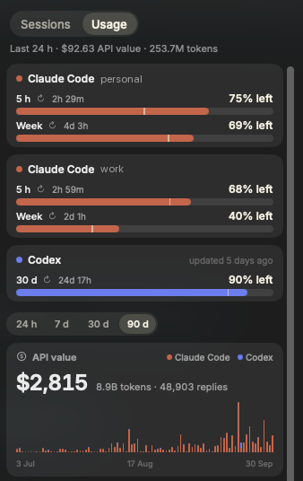
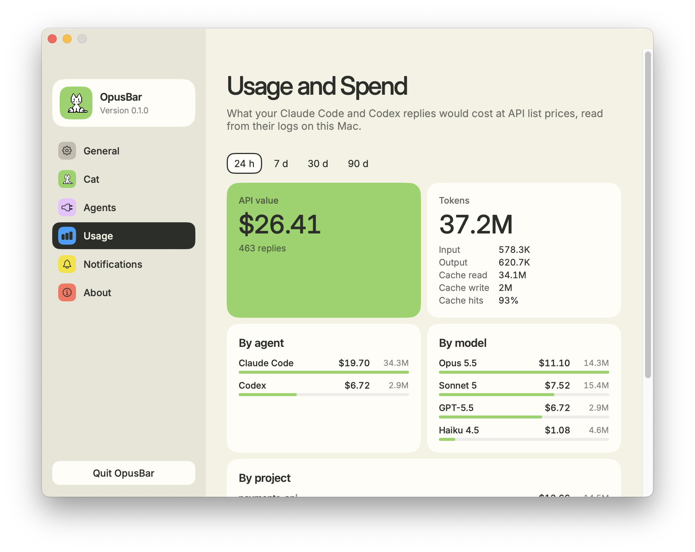
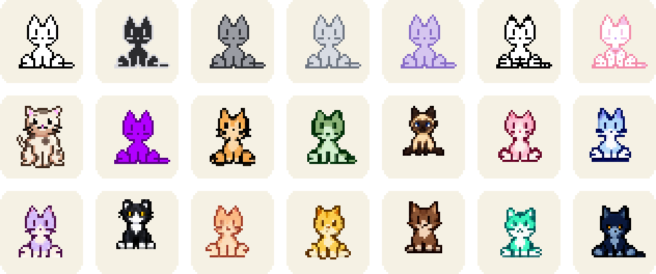

<div align="center">



# OpusBar

**A cat in your menu bar that watches your coding agents.**

Every Claude Code and Codex session at a glance. Know the second one needs you, and see how much of your plan is left.

[**Install OpusBar**](#install) · [Website](https://kushalbanda.com/opusbar/)

Free and open source · macOS 14 or later · Apple silicon and Intel

<br>

https://github.com/user-attachments/assets/e6d5e839-8786-4419-8ba4-bc8e238dcb06

<br><br>

<picture>
  <source media="(max-width: 700px)" srcset="docs/assets/states-narrow.png">
  
</picture>

</div>

## Four terminals, one stuck agent

A refactor in one terminal, a test fix in another, and Codex chewing on a migration somewhere behind your browser. One of them has been sitting on a permission prompt for ten minutes, and you won't find out until you go looking.

OpusBar puts every running session in your menu bar. The cat takes on the state of the most urgent one:

| The cat is | The session is |
| --- | --- |
| running | **working**, calling tools |
| grooming | **thinking** |
| on alert | **waiting for you**: a permission or a question |
| napping | **done** |
| yawning | **stuck on an error** |
| sitting | **idle** |

A badge on the cat counts the sessions waiting for you, or marks one that finished or failed. Click the cat for the full list: each session's folder, git branch, agent, and how long it has been running.

<p align="center">
  
  &nbsp;
  
</p>

<p align="center"><sub>The menu: every session, and your limits and spend one tab over. Shown with sample data.</sub></p>

## What it does

### Live sessions

Claude Code and Codex, in any terminal, tmux pane or editor. Running agents show up within 30 seconds, even before you connect anything. Connect the agents in Settings and the cat also knows *what* each session is doing: working, thinking, or waiting for you.

### Notifications

A notification when a session needs you or hits an error. Finished sessions can ping too; that one starts off, since it gets chatty with many sessions.

### Plan limits

Your 5-hour and weekly windows for every Claude Code and Codex account, with the time each one resets. OpusBar warns at 80% and 95% and tells you when a window renews. Work and personal profiles, or a second `CODEX_HOME`, each keep their own limits. Claude figures refresh after every reply.

### Usage and API value

Tokens over the last 24 hours, 7, 30 or 90 days, split by agent, account, model and project, with a daily chart. Next to them is the *API value*: what the same tokens would cost at Anthropic's and OpenAI's list prices. On a subscription, that's what your plan is covering. It's read straight from your agents' own logs, so your history is there on first launch.

<p align="center">
  <picture>
    <source media="(prefers-color-scheme: dark)" srcset="docs/assets/settings-usage-dark.png">
    
  </picture>
</p>

## Pick your cat

<div align="center">
<picture>
  <source media="(max-width: 700px)" srcset="docs/assets/coats-narrow.png">
  
</picture>
</div>

<br>

Twenty-one coats, from the original 1989 oneko to Catppuccin and Vaporwave. You can pick the pose for each state, the cat's size in the menu bar, and whether it naps when nothing is running.

It stays light on your Mac. The menu bar cat never draws more than 4 frames a second, stops 30 seconds after the last change, and holds still when Reduce Motion is on. Once still, it uses no CPU.

## Install

Paste this into Terminal:

```sh
curl -fsSL https://raw.githubusercontent.com/kushalBanda/OpusBar/main/scripts/install.sh | bash
```

The script downloads the latest release and checks it against the published SHA-256. It then puts OpusBar in `/Applications` (or `~/Applications` if that isn't writable) and opens it. [Read the script](scripts/install.sh) first if you like; it's short.

**Prefer a DMG?** Download it from [Releases](https://github.com/kushalBanda/OpusBar/releases/latest). OpusBar isn't notarized by Apple yet, so the first launch takes one extra step. Open the app once and macOS blocks it. Then go to **System Settings › Privacy & Security** and click **Open Anyway**. The curl install skips this.

The cat appears in your menu bar, dimmed until a session starts.

**Then connect your agents.** Open **Settings › Agents** and click **Connect** next to Claude Code and Codex:

- For Claude Code, OpusBar adds its hooks and wraps your status line so it can read plan limits. Your own status line still shows, exactly as before. Sessions you started before connecting pick up the hooks once restarted.
- Codex (0.155 or later) asks you to trust new hooks. Run `/hooks` inside Codex once and approve OpusBar's.

Updates install themselves: OpusBar downloads each one in the background, checks its signature, and swaps it in when you quit. A card in the menu shows what changed, once. Prefer a click? Turn off **Install updates automatically** in **Settings › About**. Nothing is replaced before the signature checks out.

## What it touches

Everything stays on your Mac. There's no account, no telemetry and no analytics. Here is the complete list.

**It reads:**
- **Hook events from your agents.** The hook keeps [eleven fields](docs/adr/4-local-only-slim-events.md), including session id, event name, folder and tool name. It also keeps the agent's process id and four terminal variables (`TERM_PROGRAM`, `TERM_SESSION_ID`, `ITERM_SESSION_ID`, `TMUX`). The rest of each event, including your prompts, code and replies, is dropped inside the hook before it reaches OpusBar.
- **Your agents' session logs**, for usage. Per reply, only the time, model, project folder, session id and token counts are kept, and nothing older than 90 days.
- **Plan limits**:
  - the figures Claude Code hands its status line
  - the limits Claude Code caches in each profile's `.claude.json`, along with that account's id and email, used to tell accounts apart
  - the limits in Codex's own logs
- **The process list**: each agent process's arguments and working folder, never its environment. Also the session files that match processes to sessions.
- **`.git/HEAD`** in each session's folder, for the branch name.

**It writes:**
- Hook entries, only in the agents you connect: each Claude profile's `settings.json` (plus the status line wrapper) and Codex's `hooks.json`. Each file is backed up before any change.
- Its own folder, `~/Library/Application Support/OpusBar`. That holds a copy of the hook, the backups, the latest Claude limits and the socket the hook talks to.

**It sends:** one request, a daily update check to GitHub carrying only OpusBar's version. Turn it off in **Settings › About**.

**Your agents come first.** The hook has a 200 ms deadline and exits quietly when OpusBar isn't running, so your agents never wait on it.

## Uninstall

1. In **Settings › Agents**, click **Disconnect** for each agent. This removes the hooks and puts your own status line back.
2. Quit OpusBar and drag it to the Trash.
3. Optionally, delete `~/Library/Application Support/OpusBar`.

Do step 1 first. Otherwise Claude Code's status line points at a helper that no longer exists and goes blank.

## Troubleshooting

**I can't see the cat.** On a MacBook with a notch, a crowded menu bar hides items behind it. Hold ⌘ and drag other icons out of the menu bar to make room.

**A session shows up but stays idle.** The agent isn't connected, or the session started before you connected it. Connect it in Settings › Agents and restart the session.

**Codex sessions never change state.** Hooks need Codex 0.155 or later. Update Codex, then run `/hooks` in it and approve OpusBar's hooks.

**No Claude limits yet.** They appear after the first reply in a connected session.

**The DMG won't open.** Try to open it once, then go to System Settings › Privacy & Security and click Open Anyway. Or use the curl install.

Something else? [Open an issue](https://github.com/kushalBanda/OpusBar/issues).

## Build from source

Needs macOS 14 or later and Xcode 15.4 or later. No third-party dependencies.

```sh
git clone https://github.com/kushalBanda/OpusBar.git
cd OpusBar
swift test
scripts/bundle.sh        # builds build/OpusBar.app
```

Design decisions live in [`docs/adr`](docs/adr), one short record each, from the socket protocol to why the cat is capped at 4 fps.

## Credits

The cat is [oneko](https://en.wikipedia.org/wiki/Neko_(software)), the desktop cat from 1989, by way of [oneko.js](https://github.com/adryd325/oneko.js). Coats come from [0xdhrv/oneko](https://github.com/0xdhrv/oneko), [catppuccineko](https://github.com/k01e-01/catppuccineko) and [spicetify-oneko](https://github.com/kyrie25/spicetify-oneko), under MIT. Full notices are in [LICENSE](LICENSE).

The Claude Code and Codex logos come from [Lobe Icons](https://github.com/lobehub/lobe-icons) (MIT); the marks belong to Anthropic and OpenAI. OpusBar is not affiliated with either. Licensed under [Apache 2.0](LICENSE).
