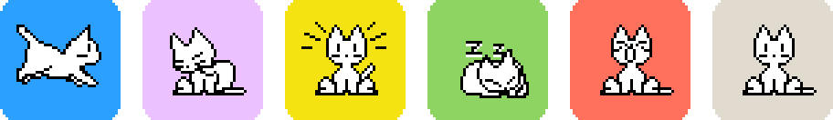

<div align="center">


# OpusBar

**A cat in your menu bar that watches your coding agents.**

Claude Code and Codex, every session, at a glance. Know the second one needs you,<br>
see how close you are to your plan limit, and stop tab-hunting through terminals.

[**Download for macOS**](https://github.com/kushalBanda/OpusBar/releases/latest) &nbsp;·&nbsp; Free &nbsp;·&nbsp; Open source &nbsp;·&nbsp; macOS 14+

<br>



</div>

<br>

## You started four agents. Which one is waiting on you?

You kicked off a refactor in one terminal, a test fix in another, and Codex is chewing on a migration somewhere behind your browser. One of them has been sitting on a permission prompt for ten minutes. You won't find out until you go looking.

OpusBar puts every running session in your menu bar, and the cat tells you how they're doing without you having to look twice.

| The cat is… | Because a session is… |
| --- | --- |
| running | **working**, calling tools |
| grooming | **thinking** |
| on alert | waiting for **you**: a permission, a question |
| napping | **done** |
| yawning | hit an **error** |
| sitting | idle |

When several sessions are going, the cat shows the most urgent one, with a badge counting how many need you. Click it for the full list: every session with its folder, git branch, agent and how long it's been at it.

## What it does

**Live sessions.** Claude Code and Codex, across every terminal, tmux pane and editor. Sessions show up the moment an agent starts, even before you connect anything.

**Notifications that matter.** A ping when a session needs you, hits an error, or finishes. Nothing for the noise in between. Click one to open the menu.

**Plan limits.** Your 5 hour and weekly allowances for every Claude Code and Codex account, with the time each one resets. OpusBar warns you at 80% and 95%, and tells you when a window renews so you can get back to it.

**Usage and spend.** Tokens and API value over 24 hours, 7, 30 or 90 days. Broken down by agent, account, model and project, with a daily chart. Read straight from your agents' own logs, so it's there from the first launch, history included.

**Multiple accounts.** Work and personal Claude profiles, a second `CODEX_HOME`, whatever you run. OpusBar finds them and keeps their limits apart.

## Pick your cat

<div align="center">

</div>

<br>

21 coats, from the original 1989 oneko to Catppuccin, Siamese, Tuxedo and Vaporwave. Choose what the cat does for each state, how big it sits in the menu bar, and whether it naps when nothing is running. It never animates faster than 4 frames a second, stops moving 30 seconds after the last change, and holds still when Reduce Motion is on. Idle, it uses 0% CPU.

## Install

Paste this into Terminal:

```sh
curl -fsSL https://raw.githubusercontent.com/kushalBanda/OpusBar/main/scripts/install.sh | bash
```

It downloads the latest release, checks it against the published SHA-256, puts OpusBar in `/Applications` and opens it. [Read the script](scripts/install.sh) first if you like; it's short.

Prefer a DMG? Grab it from [Releases](https://github.com/kushalBanda/OpusBar/releases/latest). OpusBar isn't notarized by Apple yet, so the first launch needs one extra step: open **System Settings › Privacy & Security** and click **Open Anyway**. The curl install skips this.

Then open **Settings › Agents** and click **Connect** next to Claude Code and Codex. For Codex, approve the hooks once inside Codex with `/hooks`.

OpusBar updates itself. Every update is signed, and the app checks that signature before it replaces anything.

## Private by design

OpusBar reads what's already on your Mac and keeps it there.

- **Your prompts never leave the agent.** The hook keeps a short allowlist of fields (session id, event name, folder, tool name) and drops everything else before it reaches OpusBar. Prompt text, code and replies are never read, stored or sent.
- **No account, no telemetry, no analytics.** The only network request OpusBar ever makes is the update check to GitHub, and you can turn it off.
- **It can't slow your agents down.** The hook has a 200 ms deadline and always exits cleanly. Quit OpusBar and your agents carry on as if it was never there.
- **Easy to undo.** Settings › Agents › Disconnect removes the hooks, and OpusBar keeps a backup of every config file it touches.

## Build from source

Needs macOS 14+ and Xcode 15.4 or later. No third-party dependencies.

```sh
git clone https://github.com/kushalBanda/OpusBar.git
cd OpusBar
swift test
scripts/bundle.sh        # builds build/OpusBar.app
```

Design decisions live in [`docs/adr`](docs/adr), one short record each, from the socket protocol to why the cat is capped at 4 fps.

## Credits

The cat is [oneko](https://en.wikipedia.org/wiki/Neko_(software)), the desktop cat from 1989, by way of [oneko.js](https://github.com/adryd325/oneko.js). Coats from [0xdhrv/oneko](https://github.com/0xdhrv/oneko), [catppuccineko](https://github.com/k01e-01/catppuccineko) and [spicetify-oneko](https://github.com/kyrie25/spicetify-oneko), under MIT. Type set in [Inter](https://rsms.me/inter/) and [Pixelify Sans](https://github.com/eifetx/Pixelify-Sans).

OpusBar is not affiliated with Anthropic or OpenAI.

## License

[Apache 2.0](LICENSE)
